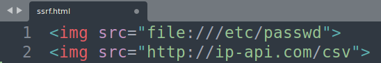
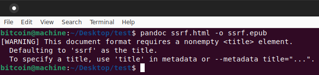
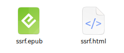
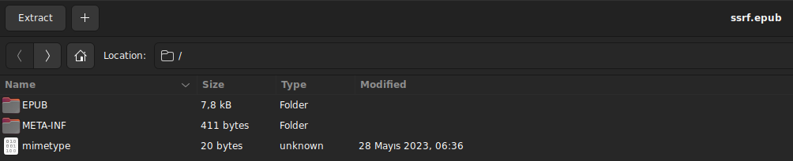
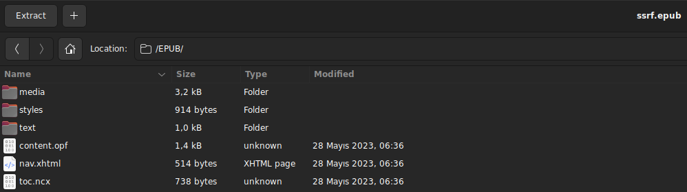
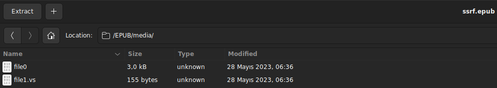
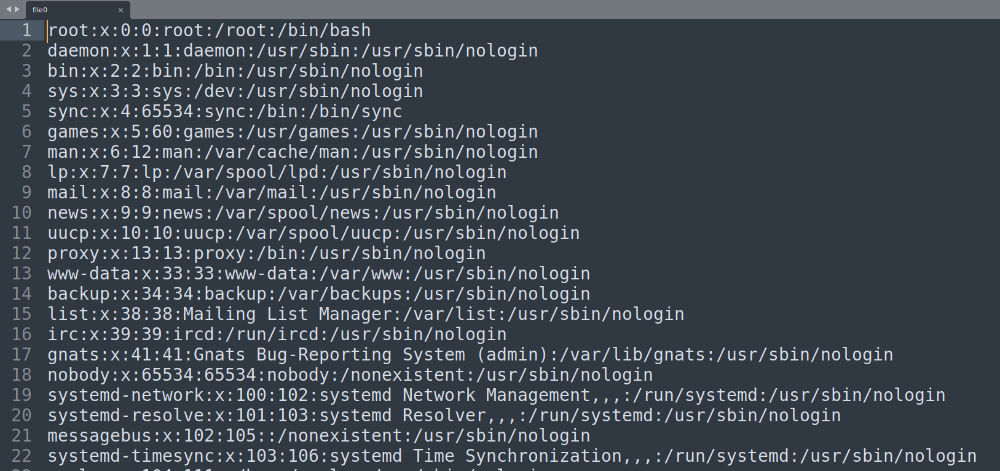
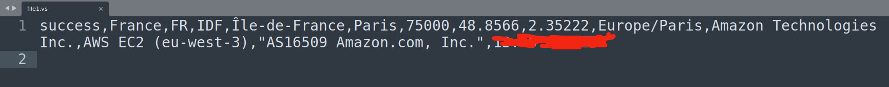

# :bee: CVE-2023-46303 - SSRF Vulnerability in PANDOC and CALIBRE
-
-
-
-
## :mushroom: PANDOC

### :spider_web: https://github.com/jgm/pandoc (Pandoc in Github)
- What is Pandoc?
- Pandoc is a Universal Markup Converter

---
-
-
-
-
## :mushroom: CALIBRE

### :spider_web: https://github.com/kovidgoyal/calibre (Calibre in Github)
- What is Calibre?
- The official source code repository for the calibre ebook manager

---
-
-
-
-

## For Example
+ ### We install both applications on a linux computer and create a test file with html

### :lady_beetle: ssrf.html
+ ``
+ ``
+ 

## Where does the vulnerability occur and how is it triggered?
+ When we want to convert an html file to a different document via terminal, we use the following command.
+ `$ pandoc ssrf.html -o ssrf.epub` PANDOC
+ `$ ebook-convert ssrf.html ssrf.epub` CALIBRE

## SSRF via Converter (Example is PANDOC but you can also try CALIBRE)
+ `$ pandoc ssrf.html -o ssrf.epub` PANDOC
+ 
+ 
+ After the html file is successfully converted to epub file, you need to open this epub file with "Archive Manager"
+ When we check the folders and subfolders in the epub file we opened with "Archive Manager", we will see one or two different files. When we open these files, we can see that the ssrf vulnerability is triggered.
+ 
+ 
+ 
+ 
+ 

---
-
-
-
-

+ I went through all converter processes in pandoc and calibre and found that this vulnerability exists in multiple converters.
+ In the table below, you can examine what types of ssrf are in which files.
+ You can also use the iframe tag instead of the img tag in calibre.

| PANDOC | EPUB | ODT | DOCX | PPTX | FB2 |
| --- | --- | --- | --- | --- | --- |
`` | :heavy_check_mark: | :heavy_check_mark: | :x: | :heavy_check_mark: | :x:
`` | :heavy_check_mark: | :heavy_check_mark: | :heavy_check_mark: | :x: | :heavy_check_mark: (Base64 Encoded)

| CALIBRE | EPUB |
| --- | --- |
`` | :heavy_check_mark: |
`` | :x: |

+ In the example, we converted our html file to epub, but as you can see in the table above, we can see that the vulnerability is triggered not only when converting to epub but also other files.
---
-
-
-
-

> #### Created by 0x1717 aka GYG3S
